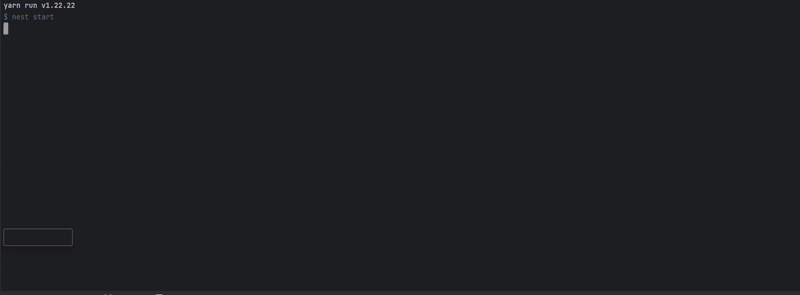

# Example Project: Message Handling with RabbitMQ

This project demonstrates how to simplify asynchronous and synchronous message handling using buses, handlers, channels, and consumers. It leverages RabbitMQ as the message broker to enable scalable, decoupled communication between services.



## Features
- Supports both synchronous and asynchronous message handling
- Utilizes message buses, handlers, channels, and consumers
- Dockerized RabbitMQ setup for easy deployment
- Scalable and reliable architecture

## Prerequisites
Make sure you have the following installed:
- [Docker](https://www.docker.com/get-started)
- [Node.js](https://nodejs.org/) (if running locally without Docker)

## Getting Started

### 1. Clone the Repository
```sh
git clone git@github.com:nestjstools/messaging-rabbitmq-example.git
cd messaging-rabbitmq-example
```

### 2. Start App with RabbitMQ
```sh
make start
```
This will start RabbitMQ in a Docker container.


### 4. Got to endpoints and see results in console
```sh
* http://localhost:3000
* http://localhost:3000/not-existed-handler
```
