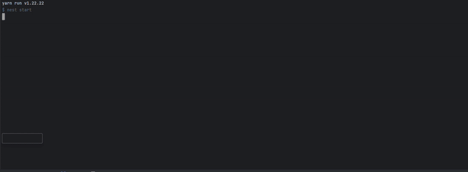

# Example Project: Message Handling with RabbitMQ, Redis, and MQTT

This project demonstrates how to simplify asynchronous and synchronous message handling using buses, handlers, channels, and consumers. It includes RabbitMQ, Redis, and an MQTT (Mosquitto) broker for scalable, decoupled messaging.



## Features
- Supports both synchronous and asynchronous message handling
- Utilizes message buses, handlers, channels, and consumers
- Dockerized RabbitMQ, Redis, and MQTT (Mosquitto) setup for easy deployment
- Scalable and reliable architecture

## Prerequisites
Make sure you have the following installed:
- [Docker](https://www.docker.com/get-started)
- [Node.js](https://nodejs.org/) (if running locally without Docker)

## Getting Started

### 1. Clone the Repository
```sh
git clone git@github.com:nestjstools/messaging-rabbitmq-example.git
cd messaging-rabbitmq-example
```

### 2. Start the messaging services
```sh
make start
```
This starts RabbitMQ, Redis, and MQTT in Docker. MQTT listens on `mqtt://localhost:1883`.

Set `MQTT_URI` to use another broker; it defaults to `mqtt://localhost:1883`. The MQTT example uses `my_app_command.create_user` as both the MQTT topic and the NestJS routing key; dots are valid in MQTT topic names.


### 4. Got to endpoints and see results in console
```sh
* http://localhost:3000
* http://localhost:3000/not-existed-handler
* http://localhost:3000/mqtt
```
